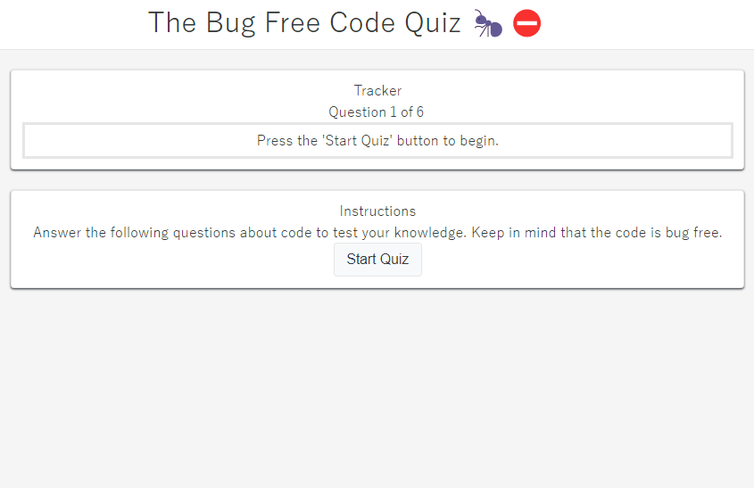

# The Bug Free Code Quiz

### Introduction Screenshot

---

### Table of Contents

- [The Bug Free Code Quiz](#the-bug-free-code-quiz)
    - [Introduction Screenshot](#introduction-screenshot)
    - [Table of Contents](#table-of-contents)
  - [Description](#description)
  - [How To Use](#how-to-use)
      - [Deployment](#deployment)
      - [Installation](#installation)
  - [References](#references)
  - [License](#license)
  - [Author Info](#author-info)

---

## Description

A simple quiz to test your knowledge of JavaScript and help you learn. The quiz is timed and the score is your remaining time plus 10 points for every correct answer. The quiz is also bug free.
<!-- 
List of technologies to be added 
#### Technologies

- Technology 1
- Technology 2 -->

[Back To The Top](#the-bug-free-code-quiz)

---

## How To Use

#### Deployment

The website is deployed [here](https://bizthehabesha.github.io/bug-free-code-quiz/).

#### Installation

N/A

[Back To The Top](#the-bug-free-code-quiz)

---

## References

- [W3Schools](https://www.w3schools.com/)

[Back To The Top](#the-bug-free-code-quiz)

---

## License

No liscense.

[Back To The Top](#the-bug-free-code-quiz)

---

## Author Info

My name's Biz and I'm a full stack web developer. I've recently finished my portfolio website, which you can find hosted on [Github](https://www.linkedin.com/in/bisrat-gebrekidan-242b231b8/).

[Back To The Top](#the-bug-free-code-quiz)